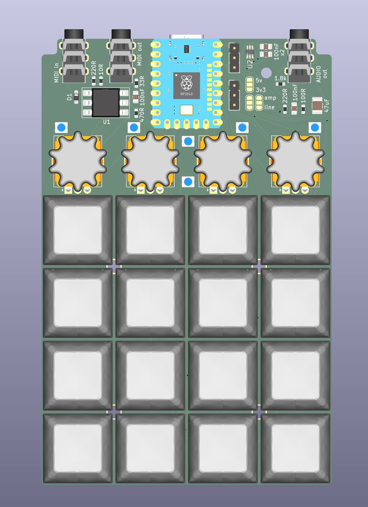

# OMSK

OMSK is an experimental, pocket-sized hardware platform designed primarily (but not exclusively) for custom synthesizer firmware development. Built around the RP2350-Zero microcontroller module, OMSK packs an exceptional density of tactile controls, audio routing, and visual indicators into a highly portable footprint.

## Hardware Features

* **MCU:** RP2350-Zero module (or RP2040-Zero)
* **Controls:**
  * 4x4 matrix of Kailh Choc v2 mechanical switches (supports hot-swap sockets)
  * 4 rotary encoders (e.g., Alps EC12)
* **Display:** 128x64 OLED screen (supports SH1107 or SSD1312 via I2C)
* **Visuals:** 22 addressable RGB LEDs (WS2812B MINI-E) for parameter tracking and custom animations
* **Audio & Connectivity:**
  * Built-in mono PWM audio output (with optional onboard headphone amplifier circuit)
  * Classic hardware MIDI In/Out jacks (TRS Type A)
  * USB MIDI class-compliant device interface
  * Support for an optional external PCM5102 I2S DAC for high-fidelity stereo audio

For more details on assembly, schematic routing, and BOM, see the [Hardware PCB Guide](hardware/pcb/README.md) and [3D Case/Enclosure Design](hardware/case/README.md).

## Bare-metal Software

All official firmware is written in pure C/C++ using the native Raspberry Pi Pico SDK. There is no Arduino overhead and no RTOS, ensuring maximum CPU availability, bare-metal performance, and sub-millisecond audio and MIDI latency.

### Architecture

Rather than compiling a single monolithic application, OMSK uses separate firmware files for different applications. This separation is dictated by hardware memory limits and fundamental architectural differences:

* Synthesizer engines require different memory structures (e.g., flash space allocated for wavetables and filter LUTs vs. granular sample buffers).
* Audio paths, envelopes, and modulation matrices differ completely between engines.

All firmware targets share a unified low-level core library located in [firmware/shared](firmware/shared), but compile as independent binaries.

### Firmwares

Explore the firmware directory at [firmware](firmware) to flash any of the following targets:

* **[omsk_wave](firmware/omsk_wave):** A polyphonic wavetable synthesizer featuring deep modulation routing, resonant filters, and non-volatile patch storage.
* **[omsk_grain](firmware/omsk_grain):** A 4-voice granular synthesizer offering real-time grain manipulation, modulation matrices, and full MIDI control.
* **[omsk_fm](firmware/omsk_fm):** An FM (Frequency Modulation) synthesizer engine.
* **[omsk_tracker](firmware/omsk_tracker):** A pocket music tracker and step sequencer to compose patterns and songs directly on the device. [planned]
* **DMK:** A customizable mechanical macropad firmware featuring full Vial compatibility. Remap keys, layout layers, macros, and rotary encoder actions directly from your web browser.
* **[omsk_midi](firmware/omsk_midi):** A simple demonstration firmware that configures the device as a class-compliant USB/TRS MIDI controller.
* **[omsk_oled_test](firmware/omsk_oled_test):** A diagnostic utility to test OLED display functionality, address configuration, and graphics rendering.

Both synth engines support full MIDI CC mapping and preset saving directly to the onboard non-volatile memory.

## Roadmap & Status

This project is currently a work in progress.

* **Hardware:** Case and knob designs are being actively iterated.
* **Software:** A dedicated web-based editor using WebMIDI is planned to allow quick parameter tweaking, firmware updates, and preset backup/sharing.
