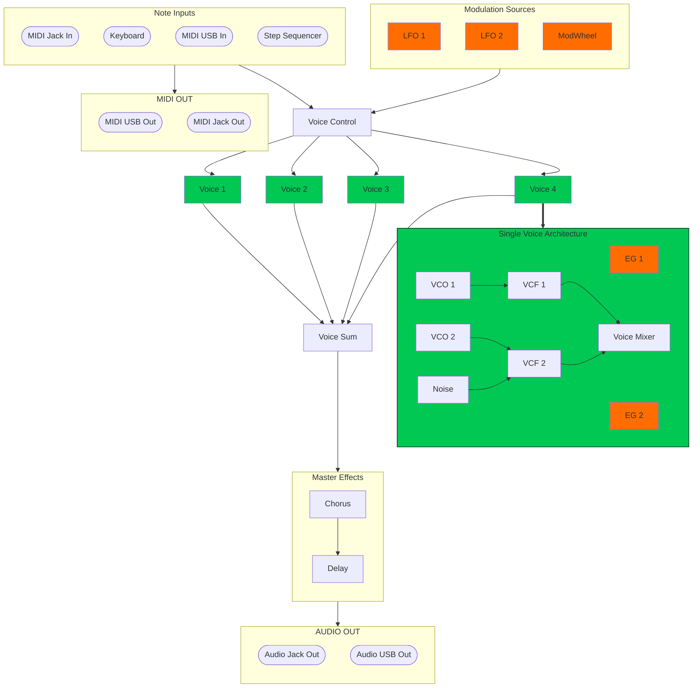

# Synthesizer Architecture Diagram

Below is the signal flow and modulation routing diagram for the 4-voice polyphonic synthesizer.

## LED Indication

The instrument is equipped with 22 WS2812B RGB LEDs providing real-time visual feedback.

### Mode Status LEDs

Two LEDs located between encoders (LED 3 and 4) indicate system status. In sequencer mode, they display transport state (Play/Stop) and active step page. See details in [Sequencer LED Indication](#led-indication-in-seq-mode).

### Button LEDs (4x4 Matrix)

16 LEDs located under physical matrix pads change behavior depending on current operation mode:

* **In PIANO mode**, they highlight keyboard structure (white/black keys) and octave transpose/arpeggiator state. See [PIANO Mode LED Indication](#piano-mode-led-indication).
* **In PARAMS mode**, they display active synth modules and current routing. See [PARAMS Mode Module LED Indication](#params-mode-module-led-indication).
* **In SEQ mode**, they show active steps, playhead position, trigger probabilities, and stop steps. See [SEQ Mode LED Indication](#led-indication-in-seq-mode).

### Encoder LEDs (All modes)

4 LEDs above encoder knobs display current values of controlled parameters with a smooth gradient from **Blue** (min 0) through **Purple** (mid 64) to **Red** (max 127).

## Layouts

| enc1 | enc2 | enc3 | enc4 |
| ---- | ---- | ---- | ---- |
| sw1  | sw2  | sw3  | sw4  |
| sw5  | sw6  | sw7  | sw8  |
| sw9  | sw10 | sw11 | sw12 |
| sw13 | sw14 | sw15 | sw16 |

## Core Units

1. **Voices (Voices 1-4):** Each voice has its own set of oscillators (VCO1, VCO2), noise generator (Noise), two filters (VCF1, VCF2), and two envelopes (EG1, EG2). This preserves individual dynamics for every played note.
2. **Voice Mixer:** Mixes oscillator and noise signals before sending them to filters.
3. **Master Section:** Combines signals from all voices and routes them through **Chorus -> Delay** effect chain.
4. **Modulation:**
   * **LFO/EG:** Run locally within each voice for precise timbre control.
   * **ModWheel:** Global controller affecting assigned parameters across all voices simultaneously.

# OMSK Synth — User Manual & Technical Specification

OMSK Synth is a compact hybrid 4-voice polyphonic synthesizer powered by RP2040 and RP2350 microcontrollers. It combines a virtual-analog sound engine, piano play mode, step sequencer, Moog filters, LFOs, envelopes, and built-in FX (chorus/delay) with audio output over external I2S DAC (2ch 48kHz / 16-bit) or built-in PWM output (1ch 48kHz / 10-bit).

## Main Operating Modes

Switching between operating modes is done by **simultaneously pressing OCT↓ and OCT↑** (buttons 13 and 14 in Piano mode, or **MIXER** and **FX2** in PARAMS mode).

### Piano Mode (Play Mode)

This is the default mode when powering on the device.

By default, the following matrix note layout is active on the 4x4 matrix:

| enc1 | enc2 | enc3 | enc4 |
| ---- | ---- | ---- | ---- |
| C    | D#   | F#   | A    |
| C#   | E    | G    | A#   |
| D    | F    | G#   | B    |
| OCT↓ | OCT↑ | ARP  | ADV  |

> [!NOTE]
> You can customize physical key layout settings. For details, see [Key Layout Settings in config.md](docs/config.md).

* **Encoders 1-4**: Control parameters of the last selected module.
* **Keys 1-12 (Rows 1-3)**: Keyboard playing chromatic notes (C, C#, D... B).
* **Button 13 (Bottom row, 1)**: OCT↓ (Octave Down).
* **Button 14 (Bottom row, 2)**: OCT↑ (Octave Up).
* **Button 15 (Bottom row, 3)**: ARP (Arpeggiator).
* **Button 16 (Bottom row, 4)**: ADV (Advanced).

* **OCT↓ + OCT↑** > Switch to PARAMS/Setup Mode
* **OCT↓ + ADV** > Cycle Key for scale snapping
* **OCT↑ + ARP** > Toggle HOLD
* **ARP + ADV** > Toggle SEQ Mode
* **LFO1 + EG1** (Pads 2+3 in Params mode) > PRESET Mode (Hold for Save, Tap for Load)

#### PIANO Mode LED Indication

LEDs under matrix buttons show keyboard layout and control state:

* **White keys** (C, D, E, F, G, A, B): Soft white low brightness. Bright white on key press or MIDI note.
* **Black keys** (C#, D#, F#, G#, A#): Dim blue/cyan low brightness. Bright blue/cyan on key press or MIDI note.
* **OCT↓ and OCT↑ buttons**: Purple. Color shifts with octave transpose (more blue down, more red up), bright purple on press.
* **ARP and ADV buttons**: Dim orange. Bright orange when corresponding layer/mode is active.

#### ARP Section

| Rate | Mode | Swing | Octave |
| ---- | ---- | ----- | ------ |
| C    | D#   | F#    | A      |
| C#   | E    | G     | A#     |
| D    | F    | G#    | B      |
| OCT↓ | OCT↑ | PIANO | ADV    |

##### Ranges

| Module | Min    | Max  | Unit | Mapping / Formula (0..127)      |
| ------ | ------ | ---- | ---- | ------------------------------- |
| Rate   | 1/64   | 1/1  | --   |                                 |
| Mode   | OFF    | DRNK | ---  | OFF, UP, DOWN, UP-DN, RND, DRNK |
| Swing  | OFF/50 | 75   | %    | SIN>TRI>SAW>RSAW>SQR>PWM>PAM4   |
| Octave | -3     | +3   | oct  |                                 |

#### ADV Section

In ADV mode (selected via ADV button), the interface shifts to global settings:

| Tempo | Scale | Chord | MIDI  |
| ----- | ----- | ----- | ----- |
| C     | D#    | F#    | A     |
| C#    | E     | G     | A#    |
| D     | F     | G#    | B     |
| OCT↓  | OCT↑  | Key   | PIANO |

* **Pads 1-12**: Set Scale Key (C, C#, D... B)
* **Pad 16 (ADV/PIANO)**: Return to Piano Mode

##### Tempo

* off sync
* external sync
* 30
* 31
* …
* 300

###### Sync behaviour

When SYNC is enabled, time-based parameters are tied to musical beats and are specified as fractional parts of a beat (for example: 1/1 = whole note, 1/2 = half note, 1/4 = quarter note, 1/8 = eighth note, 1/8t = eighth-note triplet, etc.). The following knobs/parameters become beat-synced and accept sync-notation instead of absolute time:

* `Tempo` (global BPM reference)
* `ARP > Rate`
* `LFO1 > Rate` and `LFO2 > Rate` (LFO frequency is expressed as a fraction of a beat in SYNC mode)
* `GLIDE > Time`
* `FX1 (Delay) > Time`
* `EG1/EG2 > Attack`, `EG1/EG2 > Decay`, and `EG1/EG2 > Release` (envelope times are interpreted as beat fractions in SYNC mode). `Sustain` remains a level/percentage and is not beat-synced.

In SYNC mode the LFO frequency is also specified as a fraction of the beat (e.g. `1/4` = one cycle per quarter note). Triplet and dotted divisions from the `Sync MODE` list are supported.

####### Sync range

* 8/1
* 8/1t
* 4/1
* 4/1t
* 1/1
* 1/1t
* 1/2
* 1/2t
* 1/4
* 1/4t
* 1/8
* 1/8t
* 1/16
* 1/16t
* 1/32
* 1/32t
* 1/64
* 1/64t

##### Scales (MIDI Note Scale Quantizer)

* OFF / Chromatic / Thru Mode
* Major
* Minor
* Harmonic Minor
* Melodic Minor
* Dorian
* Locrian
* Lydian
* Blues
* Major Pentatonic
* Minor Pentatonic
* Augmented

##### Chords (Polyphonic Note Expansion)

When Chord mode is active, pressing a single note triggers additional notes to form a chord.

| **Category**   | **Full Name**         | **Abbr**       | **Intervals (semitones)** | **Description**               |
| -------------- | --------------------- | -------------- | ------------------------- | ----------------------------- |
| **Basic**      | OFF                   | **OFF**        | 0                         | No chord expansion            |
| **Intervals**  | Minor 2nd             | **m2**         | 0, 1                      | Minor second                  |
|                | Major 2nd             | **M2**         | 0, 2                      | Major second                  |
|                | Minor 3rd             | **m3**         | 0, 3                      | Minor third                   |
|                | Major 3rd             | **M3**         | 0, 4                      | Major third                   |
|                | Perfect 4th           | **P4**         | 0, 5                      | Perfect fourth                |
|                | Tritone               | **Tri**        | 0, 6                      | Tritone                       |
|                | Perfect 5th           | **P5**         | 0, 7                      | Perfect fifth                 |
|                | Minor 6th             | **m6**         | 0, 8                      | Minor sixth                   |
|                | Major 6th             | **M6**         | 0, 9                      | Major sixth                   |
|                | Minor 7th (Int)       | **m7i**        | 0, 10                     | Minor seventh (interval)      |
|                | Major 7th (Int)       | **M7i**        | 0, 11                     | Major seventh (interval)      |
|                | Octave                | **Oct**        | 0, 12                     | Octave                        |
| **Triads**     | Major                 | **M**          | 0, 4, 7                   | Major triad                   |
|                | Minor                 | **m**          | 0, 3, 7                   | Minor triad                   |
|                | Diminished            | **Dim**        | 0, 3, 6                   | Diminished triad              |
|                | Augmented             | **Aug**        | 0, 4, 8                   | Augmented triad               |
|                | Suspended 2           | **Sus2**       | 0, 2, 7                   | Suspended 2nd                 |
|                | Suspended 4           | **Sus4**       | 0, 5, 7                   | Suspended 4th                 |
| **7th Chords** | Major 7th             | **M7**         | 0, 4, 7, 11               | Major 7th chord               |
|                | Dominant 7th          | **Dom7**       | 0, 4, 7, 10               | Dominant 7th chord            |
|                | Minor 7th             | **m7**         | 0, 3, 7, 10               | Minor 7th chord               |
|                | Half-Diminished       | **m7b5**       | 0, 3, 6, 10               | Half-diminished 7th           |
|                | Diminished 7th        | **Dim7**       | 0, 3, 6, 9                | Diminished 7th                |
|                | Minor-Major 7th       | **mM7**        | 0, 3, 7, 11               | Minor-major 7th               |
|                | Augmented-M 7th       | **AugM7**      | 0, 4, 8, 11               | Augmented major 7th           |
|                | Augmented 7th         | **Aug7**       | 0, 4, 8, 10               | Augmented 7th                 |
| **Extended**   | Major 6th             | **M6**         | 0, 4, 7, 9                | Major 6th chord               |
|                | Minor 6th             | **m6**         | 0, 3, 7, 9                | Minor 6th chord               |
|                | Add 9                 | **Add9**       | 0, 4, 7, 14               | Major add 9                   |
|                | 7th Sus 4             | **7s4**        | 0, 5, 7, 10               | 7th suspended 4th             |
|                | M 7th Sus 4           | **M7s4**       | 0, 5, 7, 11               | Major 7th suspended 4th       |
| **Advanced**   | 7 Sharp 5             | **7#5**        | 0, 4, 8, 10               | Dominant 7 sharp 5            |
|                | 7 Flat 5              | **7b5**        | 0, 4, 6, 10               | Dominant 7 flat 5             |
|                | Quartal               | **Quart**      | 0, 5, 10, 15              | Quartal stack                 |
|                | Lydian                | **Lyd**        | 0, 4, 6, 7                | Lydian chord (#4)             |

### Param

### PARAMS / SETTINGS Mode

In this mode, the button matrix selects the active module for editing.

* **Encoders 1-4**: Change parameters of selected module.
* **Buttons 1-16**: Select active module. Active module highlights with its color.

#### Button Layout (PARAMS Mode)

| enc1  | enc2 | enc3  | enc4 |
| ----- | ---- | ----- | ---- |
| VCO1  | VCF1 | LFO1  | EG1  |
| VCO2  | VCF2 | LFO2  | EG2  |
| NOISE | FX1  | GLIDE | SET  |
| MIXER | FX2  | MOD   | FN   |

* **"MIXER" + "FX2"** > Return to Piano Mode
* **SET** (Short tap) > Toggle Assignment Mode
* **SET** (Hold) + Encoder > Adjust Modulation Depth
* **FN** (Hold) + Pad/Encoder > Clear assignment

#### PARAMS Mode Module LED Indication

| LED Index | Module | Color (base)           | Default Brightness   | Pressed / Selected Brightness |
| --------- | ------ | ---------------------- | -------------------- | ----------------------------- |
| 7         | VCO1   | White / Filter clr     | 5%                   | 70%                           |
| 8         | VCF1   | Pink (255,30,100)      | 20%                  | 70%                           |
| 9         | LFO1   | Lt Blue (100,200,255)  | 20%                  | 70%                           |
| 10        | EG1    | Lt Green (100,255,100) | 20%                  | 70%                           |
| 11        | VCO2   | White / Filter clr     | 5%                   | 70%                           |
| 12        | VCF2   | Magenta (255,0,255)    | 20%                  | 70%                           |
| 13        | LFO2   | Blue (0,0,255)         | 20%                  | 70%                           |
| 14        | EG2    | Green (0,255,0)        | 20%                  | 70%                           |
| 15        | NOISE  | White / Filter clr     | 5%                   | 70%                           |
| 16        | FX1    | Yellow (255,255,0)     | 20%                  | 70%                           |
| 17        | GLIDE  | Cyan (0,255,255)       | 20%                  | 70%                           |
| 18        | SET    | Red (255,0,0)          | 20%                  | 70%                           |
| 19        | MIXER  | Warm Wht (255,200,130) | 20%                  | 70%                           |
| 20        | FX2    | Orange (255,100,0)     | 20%                  | 70%                           |
| 21        | MOD    | Gold (255,200,0)       | 20%                  | 70%                           |
| 22        | FN     | Coral (255,80,0)       | 20%                  | 70%                           |

**VCO1/VCO2/NOISE**: By default glow white at 5%. If assigned to filter (`route_vco == 1` → VCF1/Pink, `route_vco == 2` → VCF2/Magenta), LED takes filter color.

#### Encoder Layout

| Mode         | enc1       | enc2      | enc3         | enc4      |
| ------------ | ---------- | --------- | ------------ | --------- |
| VCO1/2       | Transpose  | Detune    | Wave         | Shape     |
| VCF1/2       | Cutoff     | Resonance | Keytrack     | Mix       |
| LFO1/2       | Rate       | Smooth    | Wave         | Shape     |
| EG1/2        | Attack     | Decay     | Sustain      | Release   |
| NOISE        | Color      | Chord     | ---          | ---       |
| MIXER        | VCO1.Vol   | VCO1.Vol  | VCO1/2.Phase | Noise.Vol |
| GLIDE        | Time       | Slope     | Mode         | Poly      |
| FX1 (Chorus) | Time       | Feedback  | Depth        | Mix       |
| FX2 (Delay)  | Time       | Feedback  | Tone         | Mix       |
| SET          | Assignment | ---       | ---          | ---       |
| MOD          | s>t 1      | depth 1   | s>t 2        | depth 2   |

Shift+Noise.Vol > Master vol

#### Ranges

| Module       | Knob  | Full Name | Min   | Max    | Unit   | Mapping / Formula (0..127)      |
| ------------ | ----- | --------- | ----- | ------ | ------ | ------------------------------- |
| VCO1/VCO2    | TRNSP | Transpose | -5    | +5     | octave | `round((p-64)/64 * 5)`          |
| VCO1/VCO2    | DETN  | Detune    | -700  | +700   | cents  | `detune_table[p]` (non-linear)  |
| VCO1/VCO2    | WAVE  | Wave      | SIN   | HYB    | morph  | SIN>TRI>SAW>RSAW>SQR>PWM>PAM4   |
| VCO1/VCO2    | SHAP  | Shape     | 0     | 100    | %      | PWM or Wavefold depth           |
| VCF1/VCF2    | CUT   | Cutoff    | 50    | 8000   | Hz     | `50 * 160^(p/127)` (Log)        |
| VCF1/VCF2    | RES   | Resonance | 0.5   | 12     | Q      | `0.5 + (p/127) * 11.5`          |
| VCF1/VCF2    | KEY   | Keytrack  | 0     | 100    | %      | Filter keyboard tracking        |
| VCF1/VCF2    | MIX   | Mix       | 0     | 100    | %      | dry/wet                         |
| LFO1/LFO2    | RATE  | Rate      | 0.05  | 400    | Hz     | `0.05 * 2^((p/127)*8.64)` (Log) |
| LFO1/LFO2    | SMTH  | Smooth    | 0     | 100    | %      | LFO smoothing                   |
| LFO1/LFO2    | WAVE  | Wave      | ---   | ---    | ---    | Waveform selection (SIN..PAM)   |
| LFO1/LFO2    | SHAP  | Shape     | 0     | 100    | %      |                                 |
| EG1/EG2      | ATK   | Attack    | 0     | 2000   | ms     | Log mapped 0..2s                |
| EG1/EG2      | DEC   | Decay     | 0     | 2000   | ms     | Log mapped 0..2s                |
| EG1/EG2      | SUSTN | Sustain   | 0     | 100    | %      |                                 |
| EG1/EG2      | RELSE | Release   | 0     | 2000   | ms     | Log mapped 0..2s                |
| NOISE        | CLR   | Color     | RED   | VLT    | ---    | RED>PINK>WHITE>BLUE>VIOLET      |
| NOISE        | CHRD  | Chord     | OFF   | M7S4   | mode   | See Chord list                  |
| MIXER        | BAL   | Balance   | 100%  | 100%   | VCO1/2 | VCO1 balance vs VCO2            |
| MIXER        | O/N   | Osc/Noise | 100%  | 100%   | Mix    | Oscillators vs Noise            |
| MIXER        | PHAS  | Phase 2   | 0     | 360    | °      | VCO2 phase offset               |
| MIXER        | VOL   | Master    | 0     | 100    | %      | Master output volume            |
| GLIDE        | TIME  | Time      | 0.001 | 10     | s      | `0.001 * 10^((p/127)*4)` (Log)  |
| GLIDE        | SLOP  | Slope     | Log   | Exp    | ---    | Log < 64 < Lin > 64 > Exp       |
| GLIDE        | MODE  | Mode      | Off   | Always | ---    | Off, Legato, Always             |
| GLIDE        | POLY  | Poly mode | 4V    | Unson  | voices | 4 voices / Mono / Unison        |
| FX1 (Chorus) | TIME  | Time      | 5     | 1000   | ms     | Chorus delay time               |
| FX1 (Chorus) | FEED  | Feedback  | 0     | 100    | %      |                                 |
| FX1 (Chorus) | DPTH  | Depth     | 0     | 100    | %      | Chorus modulation depth         |
| FX1 (Chorus) | MIX   | Mix       | 0     | 100    | %      |                                 |
| FX2 (Delay)  | TIME  | Time      | 5     | 1000   | ms     | Delay time                      |
| FX2 (Delay)  | FEED  | Feedback  | 0     | 100    | %      |                                 |
| FX2 (Delay)  | TONE  | Tone      | 0     | 100    | %      | Low/High pass in feedback loop  |
| FX2 (Delay)  | MIX   | Mix       | 0     | 100    | %      |                                 |

### Params Layers

#### VCO

polyBLEP

BLIT (Band-Limited Impulse Train) — ideal band-limited impulse train generation, providing aliasing-free saw/square waves.

BLEP (Band-Limited Step) — correction added at signal step discontinuities to remove spectral artifacts.

BLAMP (Band-Limited Ramp) — same principle applied to derivative slope breaks.

#### VCF

Computing digital filters (especially resonant filters and high-order filters with large Q) is computationally expensive for microcontrollers. We recommend:

* Use precomputed lookup tables (LUT) for key coefficients/values and simple interpolation between points.
* Limit filter order or apply cascades of simple single-pole/two-pole blocks (SVF) to distribute the computational load.
* Calculate heavy coefficients when parameters change (or on low-frequency ticks), not on every audio sample.
* Implement anti-aliasing or windowing for strong modulation and in sync modes.

This approach ensures predictable performance and reduces artifacts without significantly increasing CPU load.

Cutoff Key Track [0%...100%]
Key tracking allows the note played on the keyboard to influence the cutoff frequency of the filter.
0%: No keyboard tracking will be applied.
50%: The cutoff frequency will change at half the rate/slope as the pitch of the keyboard.
100%: The cutoff frequency will change at the same rate/slope as the pitch of the keyboard.

##### Filter Type

* **Cutoff:** Range 20 Hz — 20,000 Hz.
* 2nd order filter (12 dB/oct). Several filter types supported in config (PRA32, SVF, Moog Ladder), see [Firmware Config](docs/config.md).
* **Key Tracking (±100%):** $F_{actual} = F_{cutoff} + (Note - 60) \times Tracking$. Cutoff calculation via LUT (no `pow()`).
* **Resonance:** With gain compensation to preserve volume.

| Parameter | Name        | Description | Min | Max   | Unit | Note    |
| --------- | ----------- | ----------- | --- | ----- | ---- | ------- |
| VCF1/VCF2 | LPF/BPH/HPF | Freq        | 20  | 10000 | Hz   | log     |
| VCF1/VCF2 | RES         | Resonance   | 0.5 | 12    | Q    |         |
| VCF1/VCF2 | KEYTK       | Keytrack    | 0   | 100   | %    |         |
| VCF1/VCF2 | MIX         | Mix         | 0   | 100   | %    | dry/wet |

fn+Freq changes filter type. Only label text changes, on-screen knob position remains unchanged.

Coefficients stored in LUT.

##### Filter Routing (VCF)

Assign filters to process oscillator or noise signals.

###### Filter Assignment (SET)

To route a source to a filter:

`[Filter: VCF1/2] > SET (hold) > [Source Signal] > SET (release)`

> **Example:** Assign VCF1 to VCO1:
>
> `VCF1 > SET.Down > VCO1 > SET.up`

###### Remove Routings (REMOVE)

Use `FN` key to clear routings:

| **Task**                       | **Combo**                                          |
| ------------------------------ | -------------------------------------------------- |
| **Disconnect filter from src** | `FN (hold) > [Signal Source] > FN (release)`       |
| **Reset ALL filter routings**  | `FN (hold) > [Filter: VCF1/2] > FN (release)`      |

###### Source/Target Overview

| **Type**    | **Sources (Filters)** | **Targets (Signals)** |
| ----------- | --------------------- | --------------------- |
| **Filters** | VCF1, VCF2            | VCO1, VCO2, Noise     |

#### Shape

* **SIN / TRI / SAW**: Audio-rate Wavefolding depth (up to 8 folds).
* **SQR / PWM**: Sub-pulse generation or binary folding.
* **PAM4**: Pattern-specific modifier.

#### Mixer

To ensure stable volume levels and prevent clipping across multiple voices, power conservation law normalization (Square Root Compensation) is applied.

##### Mathematical Model for Normalization

Detailed formulas, velocity calculations, and pseudocode for voice and polyphonic mixing are documented in [DSP Technical Specification](docs/dsp.md).

#### MOD

Audio-rate signal modulation applies one signal directly to another (e.g. VCO2 modulating VCO1). The engine supports amplitude modulation (AM), frequency modulation (FM), ring modulation (RM), and hard sync.

The `MIXER` phase parameter controls phase offset applied to modulators before AM/FM/RM/Sync calculations.

##### Source/Target (s/t 1)

| Name   | Source | Target | Notes           |
| ------ | ------ | ------ | --------------- |
| OFF    | ---    | ---    |                 |
| Sc 1>2 | VCO1   | VCO2   | Sync            |
| Sc 1>N | VCO1   | Noise  | Sync            |
| AM 1>2 | VCO1   | VCO2   | Amp Modulation  |
| AM 1>N | VCO1   | Noise  | Amp Modulation  |
| FM 1>2 | VCO1   | VCO2   | Freq Modulation |
| FM 1>N | VCO1   | Noise  | Freq Modulation |
| RM 1>2 | VCO1   | VCO2   | Ring Modulation |
| RM 1>N | VCO1   | Noise  | Ring Modulation |

##### Source/Target (s/t 2)

| Name   | Source | Target | Notes           |
| ------ | ------ | ------ | --------------- |
| OFF    | ---    | ---    |                 |
| Sc 2>1 | VCO2   | VCO1   | Sync            |
| Sc 2>N | VCO2   | Noise  | Sync            |
| AM 2>1 | VCO2   | VCO1   | Amp Modulation  |
| AM 2>N | VCO2   | Noise  | Amp Modulation  |
| FM 2>1 | VCO2   | VCO1   | Freq Modulation |
| FM 2>N | VCO2   | Noise  | Freq Modulation |
| RM 2>1 | VCO2   | VCO1   | Ring Modulation |
| RM 2>N | VCO2   | Noise  | Ring Modulation |

### Modulation Routing

Any parameter knob can be automated using one of five modulators: **ModWheel**, **LFO1/2**, or **EG1/2**.

**Modulation Depth:** -100% to +100%.

#### Modulator Assignment (SET)

To bind a modulator to a parameter:

* **For ModWheel:** `SET (hold) > ModWh > [Parameter] > SET (release)`
* **For LFO and EG:** `[Source: LFO1/2 or EG1/2] > SET (hold) > [Parameter] > SET (release)`

> **Example:** Bind LFO1 to VCO1 Volume:
>
> `LFO1 > SET.Down > MIXER > turn VCO1.Vol encoder > SET.up`

#### Remove Routings (REMOVE)

Use `FN` key to clear assignments:

| **Task**                         | **Combo**                                                      |
| -------------------------------- | -------------------------------------------------------------- |
| **Delete specific routing**      | `FN (hold) > [Target Parameter] > FN (release)`                |
| **Reset ALL modulator routings** | `FN (hold) > [Source: ModWh, LFO or EG] > FN (release)`       |

#### Sources and Targets Summary

| **Type**             | **Sources**   | **Targets**            |
| -------------------- | ------------- | ---------------------- |
| **Wheel**            | ModWheel      | Any control knob       |
| **LFO Generators**   | LFO1, LFO2    | Any control knob       |
| **Envelopes**        | EG1, EG2      | Any control knob       |

#### Modulation Depth

Adjust depth by holding SET while turning assigned knob. Display switches knob fill to white and shows depth value +/-100%.

##### Mathematical Model for Modulation

Detailed mathematical models, normalization tables, and pseudocode are documented in [DSP Technical Specification](docs/dsp.md).

##### UI Visualization

1. **Bargraph**: Centered indicator. Fills right when $\Delta K > 0$, left when $\Delta K < 0$.
2. **Label**: Source (`LFO1`, `LFO2`, `EG1`, `EG2`, `ModWh`) centered below bargraph.

#### Waveform

Parameters and waveforms are identical for VCO1/VCO2/LFO1/LFO2.

### Randomize Parameters

To randomize values of current module:

1. Hold selection button of target module in **PARAMS** mode (e.g., **VCO1**).
2. Press **FN**.
3. Release module button — all 4 parameters of that module are randomized.

### Seq

Plays specified notes in a loop. Up to 64 steps (16 steps * 4 pages). Each page has its RGB LED color (green, blue, purple, orange). Muted step glows at 5% brightness.

### Play Steps

| Speed | Swing | Mode  | note length |
| ----- | ----- | ----- | ----------- |
| STP1  | STP2  | STP3  | STP4        |
| STP5  | STP6  | STP7  | STP8        |
| STP9  | STP10 | STP11 | STP12       |
| STP13 | STP14 | STP15 | STP16       |

#### UI

| Speed | Swing | Mode       | Len  |
| ----- | ----- | ---------- | ---- |
| page  | step  | play/pause | slot |
| 1/4   | 1/64  | play/pause | 1/16 |

##### Color Scheme & Indication Logic (v2)

###### 1. Step Status (16 Matrix Pads)

* **Empty Step:** Off (Black).
* **Active Step (Trig):** Green (if cycle condition 2/4/8 is currently met).
* **Standby Step:** Yellow (if cycle condition 2/4/8 is NOT currently met).
* **Mute:** Pink.
* **Stop Step (Sequence End):** Red.
* **Current Step (Playhead):** White (overlaid on top with max brightness).

###### 2. Probability

Brightness defines triggering probability (for Green, Yellow, Pink):

* **100%:** Max brightness (255).
* **75-85%:** High brightness (190-210).
* **40-50%:** Medium brightness (110-130).
* **10-25%:** Low brightness (40-70).
* **0%:** Step becomes visually black.

###### 3. Status LEDs (2 RGB LEDs)

####### LED 3: Transport Status (Play/Pause)

* **Play:** Solid Green.
* **Pause/Stop:** Red (or Orange).

####### LED 4: Navigation (Pages 1-4)

* **Page 1 (1-16):** Red.
* **Page 2 (17-32):** Green.
* **Page 3 (33-48):** Blue.
* **Page 4 (49-64):** Purple.

###### Layering Priority

Evaluate LED color conditions in this exact order:

1. **Cursor:** If `current_step == LED_index`, color = **WHITE (MAX)**.
2. **Stop:** If `step == stop_step`, color = **RED**.
3. **Mute:** If `is_muted`, color = **PINK** (brightness = Probability).
4. **Loop Condition:**
   * If cycle condition matches, color = **GREEN** (brightness = Probability).
   * If cycle condition does NOT match, color = **YELLOW** (brightness = Probability).
5. **Default:** If step inactive, color = **BLACK**.

#### Play Mode Descriptions

* **Forward** (UP): plays steps 1→2→3→...→16→1 sequentially
* **Backward** (DOWN): plays steps in reverse 16→15→14→...→1→16
* **Pingpong** (UP-DN): plays forward 1→16, then immediately backward 16→1
* **Snake** (SNK): plays in a serpentine pattern across 4x4 grid (1→2→3→4→8→7→6→5→9→10→11→12→16→15→14→13)
* **Random** (RND): selects a random step on each beat
* **Drunk**: random walk — moves to an adjacent step (±1) on each beat

STP"X" > Mute step — Disables playback for specified step

#### Chords

| Chord                | Action        | Notes                                                                                         |
| -------------------- | ------------- | --------------------------------------------------------------------------------------------- |
| STP"X" > + Speed enc | probability   |                                                                                               |
| STP3+STP4            | Load/Save seq | STP3+STP4 > 1-16 key > load 1-16 preset                                                       |
| STP5+STP9            | Prev page     |                                                                                               |
| STP8+STP12           | Next page     |                                                                                               |
| STP13+STP14          | Param         |                                                                                               |
| STP15+STP16          | PIANO mode    |                                                                                               |
| STP10+STP11          | Play/Pause    | Play/Pause sequence playback                                                                  |
| STP14+STP15          | Stop step     | Sets a stop flag on the beat. If flags are set on steps 5, 8 and 9, only steps 1-4 are played |
| STP1+STP2            | Edit step     | Enter edit mode for the specified step                                                        |
| STP13+STP16          | Copy mode     | STP1.Down>STP2.Down>STP2.Up>STP1.Down>source step>target step                                 |

#### Ranges

| Knob        | Min  | Max | Unit | Note                             |
| ----------- | ---- | --- | ---- | -------------------------------- |
| speed       | 1/16 | 8   | x    |                                  |
| swing       | off  | 75  | %    |                                  |
| mode        | 1    | 8   | -    |                                  |
| note length | 0    | 100 | %    | (0, 10, 25, 40, 50, 75, 85, 100) |

### Edit Mode

| VEL  | CHRD | Every | Prob |
| ---- | ---- | ----- | ---- |
| C    | D    | E     | F    |
| G    | A    | B     | C#   |
| D#   | F#   | G#    | A#   |
| OCT↓ | OCT↑ | Clear | Done |

#### Ranges

| Knob  | Min | Max | Unit | Note                                          |
| ----- | --- | --- | ---- | --------------------------------------------- |
| VEL   | 0   | 127 |      | velocity for the step                         |
| CHRD  |     |     |      |                                               |
| Every | 1   | 8   | -    | play every loop, every 2.. every 8            |
| Prob  | 0   | 100 | %    | Probability, (0, 10, 25, 40, 50, 75, 85, 100) |
