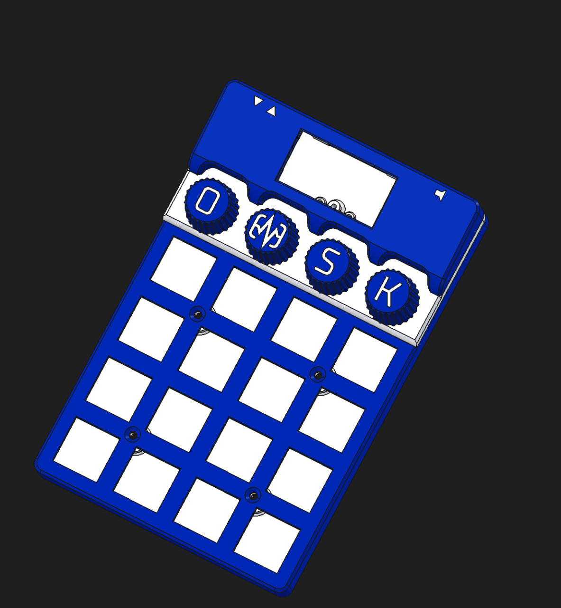
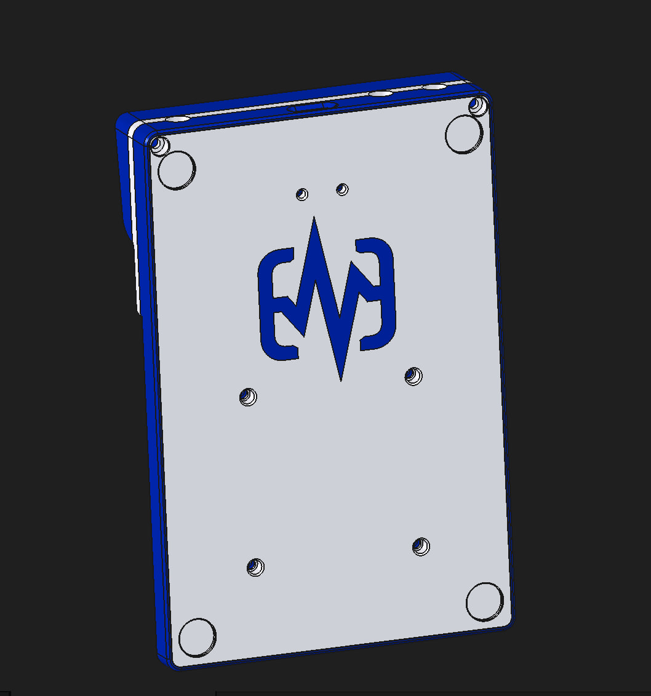

# Case

## BOM

| Item # | Description                     | Specification / Standard        | Qty | Unit | Notes                   |
| ------ | ------------------------------- | ------------------------------- | --- | ---- | ----------------------- |
| 1      | M2 x 8mm Countersunk Head Screw | DIN 965 / ISO 14581 (Flat Head) | 4   | pcs  | Countersunk             |
| 2      | M2 x 10mm Button Head Screw     | ISO 7380 (Button/Truss Head)    | 2   | pcs  | Flat Head               |
| 3      | M2 Heat-Set Threaded Insert     | OD: 3.2mm, Height: 3.0mm        | 6   | pcs  | For plastic integration |
|        | Total Parts:                    |                                 | 12  | pcs  |                         |

## 3D Printing & Models

The case is originally designed for multi-color 3D printing (`-mc` suffix), but it can also be printed in a single color without any issues.

To print a complete case, you will need all of the parts listed below, except you only need to choose **one of the two** info panel variants:

* **Info Panel Options (Choose one):**
  * [infopanel-omsk-rounded-mc.step](infopanel-omsk-rounded-mc.step) — Features a rounded border/bezel design around the encoders.
  * [infopanel-omsk-ledsvisible-mc.step](infopanel-omsk-ledsvisible-mc.step) — Features a different bezel shape around the encoders to keep the LEDs visible.

### Parts List

* [bot-omsk-mc.step](bot-omsk-mc.step) — Bottom shell
* [top-omsk.step](top-omsk.step) — Top shell
* [top-encoders-panel-omsk.step](top-encoders-panel-omsk.step) — Top panel for encoders
* [infopanel-omsk-screen-clip.step](infopanel-omsk-screen-clip.step) — Clip to secure the screen
* [knob-K-mc.step](knob-K-mc.step) — "K" knob
* [knob-M-mc.step](knob-M-mc.step) — "M" knob
* [knob-O-mc.step](knob-O-mc.step) — "O" knob
* [knob-S-mc.step](knob-S-mc.step) — "S" knob
